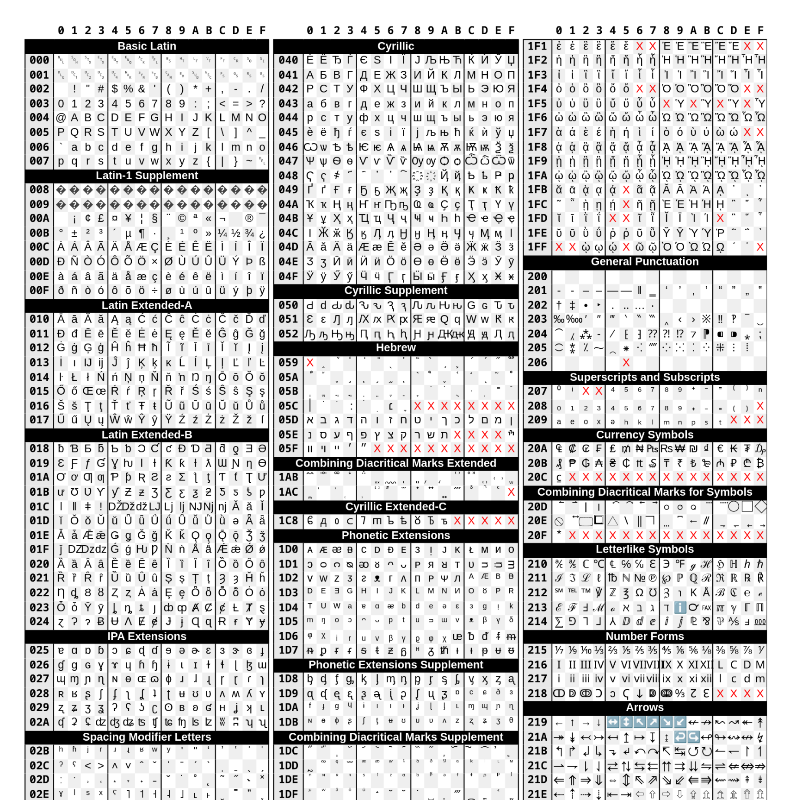

# Unicode PDF

A PDF file that lists all "useful" Unicode characters from a western point of view, i.e. everything that is not e.g. CJK/Arabic/etc. Also includes a curated list of non-printable (e.g. control, whitespace, formatting, etc.) characters. Meant for printing it out and hanging it onto a wall.

[View the PDF here](https://benjaminaster.github.io/unicode-pdf/unicode.pdf)

